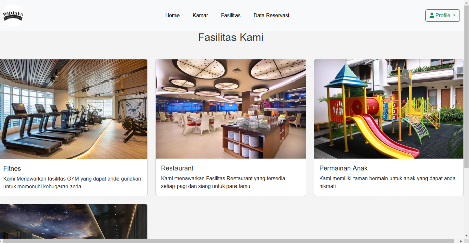

# 🏨 Sistem Reservasi Hotel - PHP Native

Sistem Reservasi Hotel ini dibangun menggunakan **PHP Native** untuk memudahkan proses pemesanan kamar, pengelolaan data pengguna, manajemen transaksi, dan penyediaan informasi fasilitas hotel.  
Aplikasi ini dilengkapi antarmuka yang responsif dan mudah digunakan, serta dashboard admin untuk memantau seluruh aktivitas reservasi.

---

## 📸 Tampilan Aplikasi

### 1. Beranda
  
Tampilan awal aplikasi yang menampilkan informasi umum hotel dan akses cepat ke fitur utama.

### 2. Beranda Admin
  
Halaman dashboard khusus admin untuk memantau statistik hotel seperti jumlah reservasi, status kamar, dan transaksi.

### 3. Daftar Kamar
  
Menampilkan seluruh daftar kamar hotel dengan detail harga, fasilitas, dan status ketersediaan.

### 4. Data User
  
Halaman admin untuk mengelola data seluruh pengguna yang terdaftar.

### 5. Fasilitas
  
Daftar fasilitas hotel yang dilengkapi dengan foto dan deskripsi singkat.

### 6. Invoice
  
Bukti pembayaran yang dihasilkan setelah proses reservasi berhasil.

### 7. Kamar
  
Galeri kamar hotel dengan detail harga dan pilihan untuk memesan.

### 8. Konfirmasi
  
Halaman admin untuk mengonfirmasi reservasi yang diajukan pengguna.

### 9. Login
  
Form login pengguna dengan desain sederhana dan aman.

### 10. Login Admin
  
Form login khusus admin untuk mengakses fitur pengelolaan hotel.

### 11. Payment
  
Halaman pembayaran yang mendukung berbagai metode transaksi.

### 12. Registrasi
  
Form pendaftaran untuk pengguna baru dengan validasi data otomatis.

### 13. Reservasi
  
Form pemesanan kamar dengan pilihan tanggal, jumlah tamu, dan tipe kamar.

### 14. Riwayat User
  
Halaman yang menampilkan riwayat reservasi pengguna.

### 15. Tambah Kamar
  
Form khusus admin untuk menambahkan data kamar baru ke sistem.

### 16. Transaksi Batal
  
Daftar transaksi yang dibatalkan oleh pengguna atau admin.

### 17. Transaksi Sukses
  
Daftar transaksi yang berhasil diproses dan dikonfirmasi.

---

## ⚙️ Teknologi yang Digunakan
- **PHP Native** untuk backend
- **MySQL** sebagai database
- **HTML, CSS, JavaScript** untuk antarmuka
- **Bootstrap** untuk desain responsif

---

## 📌 Fitur Utama
- Pemesanan kamar secara online
- Manajemen data pengguna & kamar
- Informasi fasilitas hotel
- Riwayat reservasi
- Proses pembayaran & invoice
- Dashboard admin untuk monitoring

